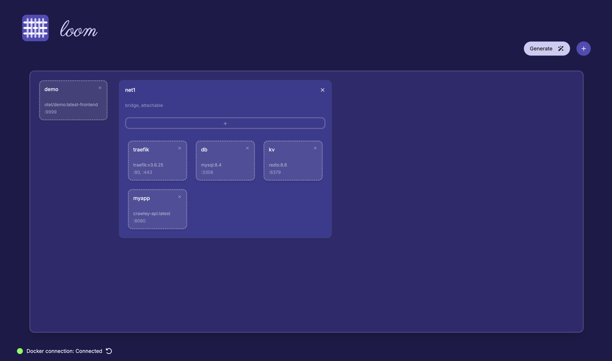
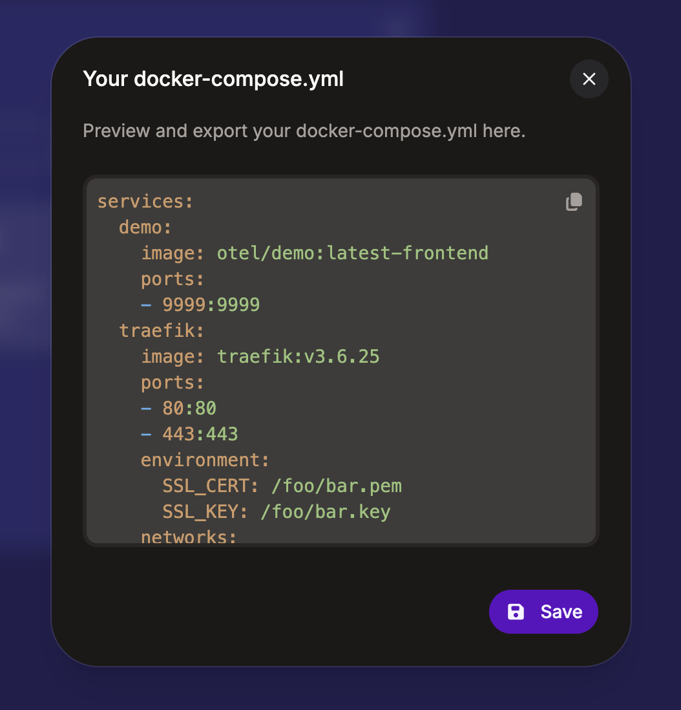

<p>
    
 </p>

 # loom

 ## What Loom Does
 Loom lets you visually create a deployment spec, and then generate a Docker Compose or (coming soon™️) Kubernetes Helm chart given that deployment.
 Hopefully useful for people like me that use the docker-compose or Helm chart spec often enough to need to deploy things, but not often enough to actually
 remember the syntax to do so ..

 <p>
    
    
</p>

 ## Usage
 Loom is a fully self-contained Aspire app, with a nodejs/React frontend and an ASPNET backend. I'd recommend opening `loom.slnx` in your preferred IDE (VisualStudio, Rider, etc), and then simply hit play on the `https` profile (hit accept on the self-signed certificate if you encounter that dialog). Or, from the command line at the top-level directory:

 ```bash
 $ dotnet run --project src/Loom/AppHost
 ```

 This will start the `UI` and `Web` projects simultaneously. This project targets .NET10, so make sure you have the [latest .NET10 SDK](https://dotnet.microsoft.com/en-us/download/dotnet/10.0).

 ## A Note About the Local Docker Daemon
 Loom will automatically attempt to find a local docker daemon instance at startup - this behavior is however controlled with an env variable `LOOM_LOCAL_DOCKER_DISABLED` which defaults to `false`. You can override this behavior by setting this env var to `true`.

 This allows loom to flatten responses from both your local docker instance's registry and Dockerhub's registry, with `Local` images preferred over Dockerhub ones, and `Official` images preferred over non-official ones from Dockerhub - i.e `Local > Dockerhub Official > Dockerhub`. You'll see this behavior in the `Image` and `Tag` fields on adding or modifying Containers in the UI, as well as see the current local Docker connection status at the bottom of the playground.

 ## TODOs
 * Secrets, Volumes, and Config (currently a noop)
 * Helm Charts